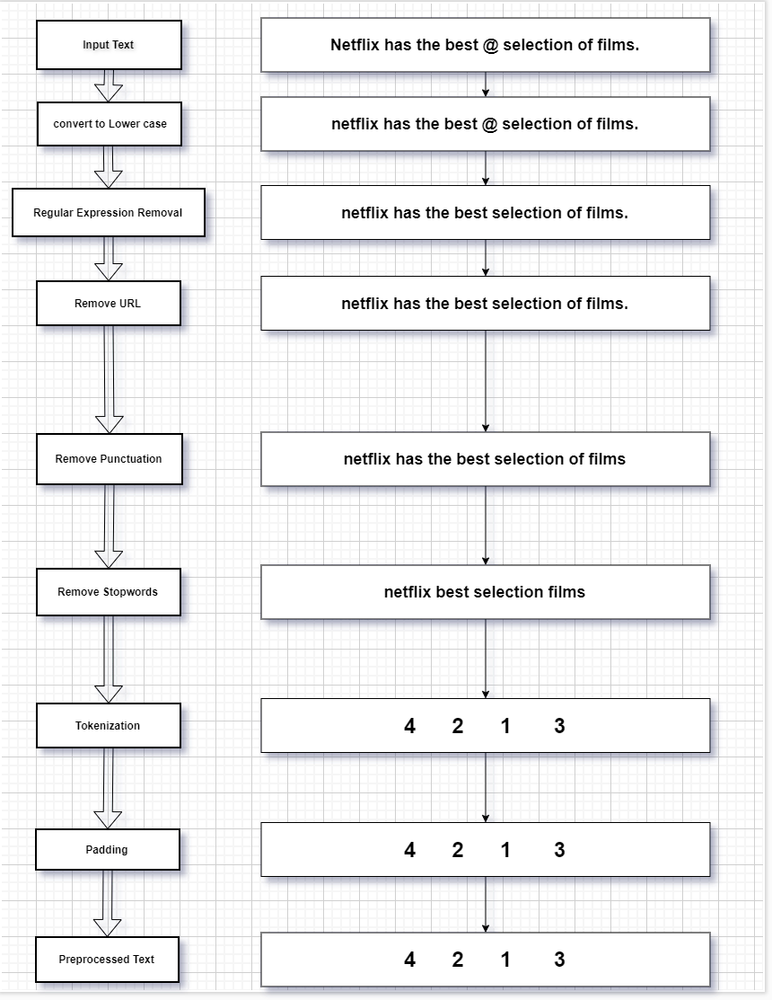
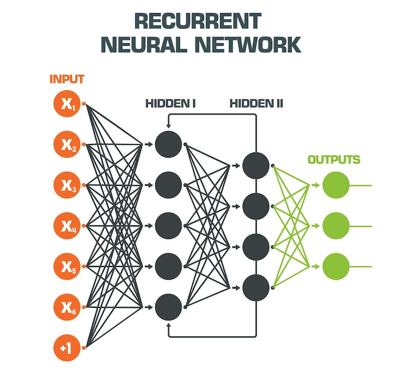
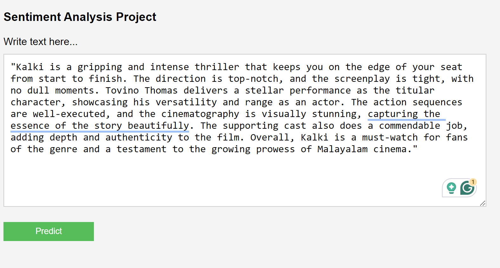
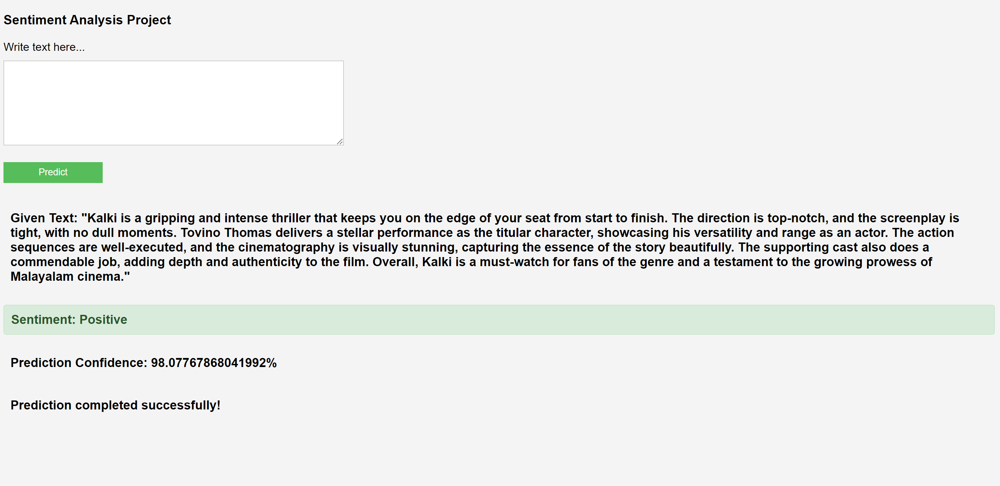
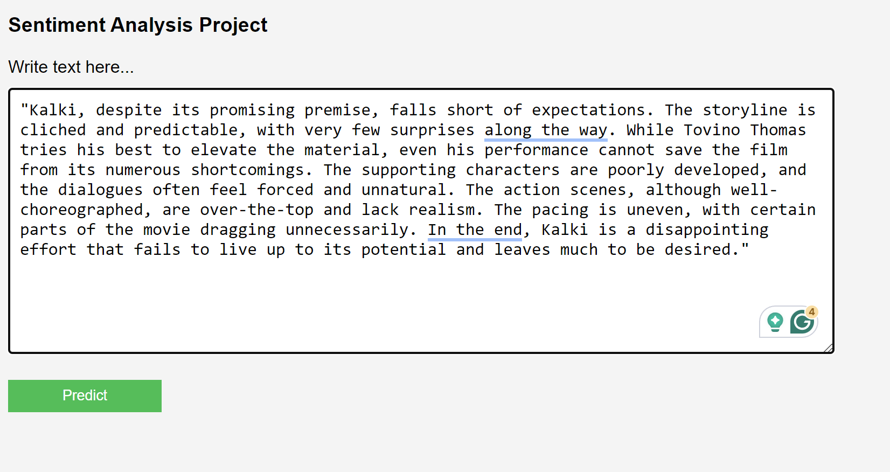
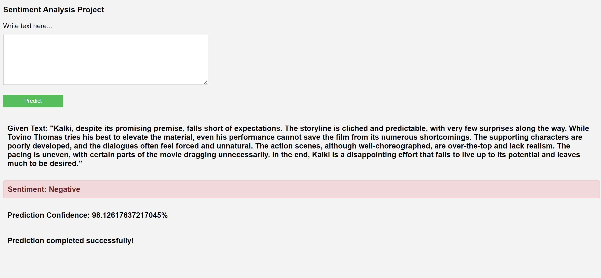

# Sentiment Analysis Project

This repository contains a Sentiment Analysis project built using TensorFlow and Keras. The goal of this project is to classify movie reviews as positive or negative.

## Table of Contents

- [Introduction](#introduction)
- [Installation](#installation)
- [Usage](#usage)
- [Model Architecture](#model-architecture)
- [Preprocessing Steps](#Preprocessing-Steps)
- [Results](#results)
- [Contact](#contact)

## Introduction

Sentiment Analysis is a natural language processing task that involves classifying text into positive or negative sentiment. This project uses a Long Short-Term Memory (LSTM) neural network to perform sentiment analysis on movie reviews.

## Installation

1. Clone the repository:
   ```bash
   git clone https://github.com/brijesh2611999/sentiment-analysis.git
   cd sentiment-analysis
   ```
   
2. Install the dependencies:
   ```bash
   pip install -r requirements.txt
   ```

## Usage

1. Run the application:
   ```bash
   python app.py
   ```

2. The application will load the pre-trained model and start a web server. You can use the web interface to input movie reviews and get sentiment predictions.

## Model Architecture

The model is built using the following layers:

+ Embedding Layer: Converts word indices to dense vectors of fixed size.
+ Bidirectional LSTM Layer: Captures dependencies in both forward and backward directions.
+ Dropout Layers: Prevents overfitting.
+ Dense Layer: Outputs the final prediction.

## Preprocessing Steps

The following preprocessing steps are applied to the text data:

+ Tokenization: Splits the text into individual words.
+ Lowercasing: Converts all characters in the text to lowercase.
+ Removing Stopwords: Eliminates common words that do not contribute to the sentiment.
+ Removing URLs: Eliminates any URLs present in the text.
+ Removing Punctuation: Strips out punctuation marks from the text.

 


 
 

## Results:

The model has been trained on a dataset of movie reviews and achieves an accuracy of approximately 86%. Below are some example predictions:

### Positive Input:
   
   
### Positive Output:
   

### Negative Input:
   

### Negative Output:
   


## Contact

Feel free to reach out if you have any questions or feedback!

- **Email:** bv2611999@gmail.com
- **LinkedIn:** [brijesh verma](https://www.linkedin.com/in/brijeshverma086/)
- **GitHub:** [brijesh2611999](https://github.com/brijesh2611999)
